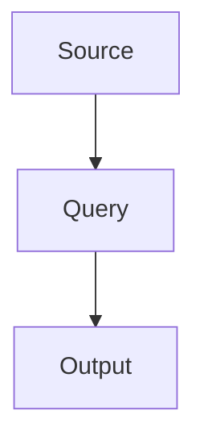

# Content Cards

## Overview

The **Content Card** is the fundamental unit of information in Symposium v2. It
combines structured data with rich markdown content, making it equally suitable
for machine processing and human consumption.

## Card Philosophy

### Everything is a Card

```
User Creates Form → Manual Card
API Responds → Source Card
Multiple Sources Aggregate → Query Card
```

All cards share the same core structure regardless of origin, enabling:

- **Unified storage** and querying
- **Consistent rendering** across views
- **Common filtering** and tagging
- **Universal search** and organization

## Card Structure

### Core Fields

```
content_card
├── Identity
│   ├── id (UUID)
│   ├── user_id (UUID)
│   └── card_type (manual | source | query)
│
├── Schema & Structure
│   ├── schema_id (UUID)
│   ├── schema_name (TEXT)
│   └── data (JSONB) - structured fields
│
├── Content
│   ├── title (TEXT, optional)
│   └── content (TEXT) - rich markdown
│
├── Origin & Tracking
│   ├── source_id (UUID, optional)
│   ├── query_id (UUID, optional)
│   ├── execution_id (UUID, optional)
│   └── api_request (JSONB, optional)
│
├── Organization
│   ├── tags (UUID[])
│   └── is_stale (BOOLEAN)
│
├── Metadata
│   ├── token_count (INTEGER)
│   ├── created_at (TIMESTAMPTZ)
│   └── updated_at (TIMESTAMPTZ)
```

### The Data vs Content Dichotomy

**data (JSONB)**: Structured, machine-readable fields

```json
{
  "priority": "high",
  "status": "in_progress",
  "assignee": "John",
  "due_date": "2024-11-15",
  "estimated_hours": 8
}
```

**Benefits**:

- Filterable in views
- Sortable in tables
- Editable inline
- Type-validated
- Searchable by field

**content (TEXT)**: Rich, human-readable narrative

```markdown
## Task Description

Implement the content card refresh mechanism allowing source-generated cards to
update from their original API source.

### Requirements

- Add refresh endpoint to backend
- Store origin data for all source cards
- Implement scheduling for automatic refreshes

### Technical Approach

The refresh system will query the `api_request` field...
```

**Benefits**:

- Full markdown support
- Special code blocks (charts, diagrams)
- Rich formatting
- Long-form documentation
- Inline field references

## Card Types

### 1. Manual Cards

**Created by**: Users through schema-driven forms

**Characteristics**:

- User-defined title
- Schema-based structured data
- Manually written content
- User-selected tags
- No source/query reference
- Never automatically updated

**Example Structure**:

```json
{
  "id": "abc123",
  "card_type": "manual",
  "schema_id": "task-schema-uuid",
  "schema_name": "Task",
  "title": "Implement Authentication",
  "data": {
    "priority": "high",
    "status": "in_progress",
    "assignee": "Sarah",
    "sprint": "Sprint 23"
  },
  "content": "## Overview\nImplement JWT-based authentication...",
  "tags": ["backend-uuid", "security-uuid"],
  "source_id": null,
  "query_id": null,
  "api_request": null,
  "token_count": 245,
  "is_stale": false
}
```

**Use Cases**:

- Project tasks and todos
- Meeting notes
- Research documentation
- Design decisions
- Bug reports
- Feature specifications

### 2. Source Cards

**Created by**: Automated source executions

**Characteristics**:

- Auto-generated title (from source name + timestamp)
- Integration-specific structured data
- API response formatted as markdown
- Source-defined tags applied
- References creating source
- Stores `api_request` for refresh
- Can become stale when source config changes

**Example Structure**:

```json
{
  "id": "def456",
  "card_type": "source",
  "schema_id": "perplexity-schema-uuid",
  "schema_name": "Perplexity Search",
  "title": "Perplexity: Latest AI Developments - Oct 30, 2024",
  "data": {
    "query": "latest AI developments and breakthroughs",
    "model": "sonar-medium-online",
    "temperature": 0.2,
    "citations_count": 8,
    "confidence_score": 0.94,
    "search_timestamp": "2024-10-30T09:00:00Z"
  },
  "content": "## Search Results\n\n### Key Developments\n\n1. **GPT-5 Preview**\n   OpenAI announced early access...\n\n2. **Anthropic Constitutional AI**\n   New safety framework...\n\n### Citations\n- [OpenAI Blog](https://...)\n- [Anthropic Research](https://...)",
  "tags": ["ai-uuid", "research-uuid", "automated-uuid"],
  "source_id": "source-abc-uuid",
  "query_id": null,
  "execution_id": "exec-xyz-uuid",
  "api_request": {
    "integration_id": "perplexity-integration-uuid",
    "config": {
      "query": "latest AI developments and breakthroughs",
      "model": "sonar-medium-online",
      "temperature": 0.2
    },
    "timestamp": "2024-10-30T09:00:00Z"
  },
  "token_count": 1842,
  "is_stale": false
}
```

**Use Cases**:

- Daily news aggregation
- API monitoring results
- Research paper summaries
- Social media trends
- Weather reports
- Stock market updates

### 3. Query Cards

**Created by**: Query executions (multi-source aggregation)

**Characteristics**:

- Auto-generated title (query name + timestamp)
- Aggregated metadata from all sources
- Template-based content combining multiple sources
- Query-defined tags applied
- References creating query
- Lists all source cards used
- Becomes stale if any source fails or changes

**Example Structure**:

```json
{
  "id": "ghi789",
  "card_type": "query",
  "schema_id": "query-schema-uuid",
  "schema_name": "Query Digest",
  "title": "Morning Tech Brief - October 30, 2024",
  "data": {
    "query_name": "Morning Tech Brief",
    "sources_executed": 3,
    "sources_succeeded": 3,
    "sources_failed": 0,
    "total_execution_time_ms": 5234,
    "cards_aggregated": ["def456", "jkl012", "mno345"]
  },
  "content": "# Morning Tech Brief\n\nGenerated: October 30, 2024 at 8:00 AM\n\n---\n\n## AI News (Perplexity)\n\n[Content from source 1]\n\n---\n\n## GitHub Trending (GitHub API)\n\n[Content from source 2]\n\n---\n\n## Hacker News Top Stories (HN API)\n\n[Content from source 3]\n\n---\n\n**Summary**: 3 sources aggregated in 5.2 seconds",
  "tags": ["digest-uuid", "automated-uuid", "morning-uuid"],
  "source_id": null,
  "query_id": "query-abc-uuid",
  "execution_id": "exec-uvw-uuid",
  "api_request": null,
  "token_count": 3456,
  "is_stale": false
}
```

**Use Cases**:

- Daily/weekly digest emails
- Multi-source research briefs
- Competitive analysis reports
- Market intelligence summaries
- Status dashboards
- Executive briefings

## Data Structure Deep Dive

### The `data` Field (JSONB)

The data field stores schema-defined structured information.

**Advantages of JSONB**:

- Flexible field structure per schema
- No ALTER TABLE for schema changes
- Rich query operators (`@>`, `?`, `->>`)
- Indexable with GIN indexes
- Type flexibility (strings, numbers, arrays, objects)

**Query Examples**:

```sql
-- Find cards with high priority
WHERE data @> '{"priority": "high"}'

-- Find cards assigned to John
WHERE data->>'assignee' = 'John'

-- Find cards with specific tag in data
WHERE data->'tags' ? 'urgent'

-- Complex nested query
WHERE data->'metadata'->>'status' = 'approved'
```

**Field Reference in Content**:

Content can reference data fields using template syntax:

```markdown
The {{priority}} priority task assigned to {{assignee}} is due on {{due_date}}.

Current status: **{{status}}**
```

Renders as:

```
The high priority task assigned to John is due on 2024-11-15.

Current status: **in_progress**
```

### The `content` Field (TEXT)

The content field stores rich markdown that supports:

#### Standard Markdown

```markdown
# Heading 1

## Heading 2

**Bold** and _italic_ text

- Bulleted lists
- With items

1. Numbered lists
2. In order

[Links](https://example.com)

> Blockquotes for emphasis

`inline code`
```

#### Code Blocks

````markdown
```javascript
function hello() {
  console.log("Hello, Symposium!");
}
```
````

#### Special Blocks (via Renderer Plugins)

**Mermaid Diagrams**:

````markdown

````

**Charts**:

````markdown
```chart:bar
{
  "labels": ["Jan", "Feb", "Mar"],
  "datasets": [{
    "label": "Sales",
    "data": [120, 190, 150]
  }]
}
```
````

**Data Tables**:

````markdown
```dataviz:table
| Name | Priority | Status |
|------|----------|--------|
| Task A | High | Done |
| Task B | Medium | In Progress |
```
````

**Embedded Content**:

````markdown
```iframe:16:9
https://www.youtube.com/embed/dQw4w9WgXcQ
```
````

### The `api_request` Field (JSONB)

For source and query cards, this field stores the exact request that generated
the card, enabling refresh capability.

**Structure**:

```json
{
  "integration_id": "uuid",
  "config": {
    "query": "search query",
    "model": "model-name",
    "temperature": 0.2,
    "any_other_params": "values"
  },
  "timestamp": "2024-10-30T09:00:00Z"
}
```

**Refresh Flow**:

```
1. User clicks "Refresh" on card
2. System reads api_request field
3. Gets integration from integration_id
4. Executes same request with same config
5. Updates data and content with new response
6. Updates updated_at timestamp
7. Clears is_stale flag
```

## Card Lifecycle

### Manual Card Lifecycle

```
Creation:
  User → Schema Selection → Form Generation
    → Field Input → Validation → Save

Editing:
  Card → Edit Button → Pre-filled Form
    → Modify Fields → Validation → Update

Deletion:
  Card → Delete Button → Confirmation → Remove
```

### Source Card Lifecycle

```
Creation (Scheduled):
  Scheduler → Source Due → Execute Integration
    → API Response → Format Data & Content
      → Create Card → Set api_request

Creation (Manual):
  User → Source → "Execute Now" Button
    → Same as scheduled

Refresh:
  User → Card → "Refresh" Button
    → Read api_request → Execute Integration
      → Update data & content → Clear is_stale

Staleness:
  Source Config Changed
    → Set is_stale=true on all source cards
      → User sees refresh prompt

Deletion:
  - If source deleted: Cards remain (orphaned)
  - Manual deletion: Normal delete flow
```

### Query Card Lifecycle

```
Creation (Scheduled):
  Scheduler → Query Due
    → For Each Source:
      → Execute Source → Collect Result
    → Apply Template → Aggregate Content
      → Create Card

Creation (Manual):
  User → Query → "Execute Now" Button
    → Same as scheduled

Staleness:
  - Query config changed → is_stale=true
  - Source config changed → is_stale=true
  - Any source fails → partial flag

Deletion:
  - If query deleted: Cards remain (historical)
  - Manual deletion: Normal delete flow
```

## Card Relationships

### Schema Relationship

Every card belongs to a schema that defines its structure:

```
Schema (defines) → Cards (instances)

Task Schema → 50 Task Cards
Article Schema → 200 Article Cards
Note Schema → 1000 Note Cards
```

**Schema Changes Impact**:

- Adding fields: Existing cards unaffected (new fields = null)
- Removing fields: Data persists in JSONB (hidden in UI)
- Modifying field types: May require data migration script

### Tag Relationships

Cards can have multiple tags (many-to-many via array):

```
Card.tags = [tag-uuid-1, tag-uuid-2, tag-uuid-3]
```

**Tag Operations**:

```sql
-- Cards with ANY of these tags (OR)
WHERE tags && ARRAY['tag1', 'tag2']

-- Cards with ALL of these tags (AND)
WHERE tags @> ARRAY['tag1', 'tag2']

-- Cards without these tags (NOT)
WHERE NOT tags && ARRAY['tag1']
```

### Source/Query Relationships

- Source cards: `source_id` references the source that created them
- Query cards: `query_id` references the query that created them
- Execution tracking: `execution_id` links to execution history

**Traceability**:

```
Source Card → source_id → Source → integration_id → Integration
Query Card → query_id → Query → source_ids → Sources
```

This enables:

- Finding all cards from a specific source
- Identifying the origin of any automated card
- Refreshing source cards with original parameters
- Re-running queries that created digests

### View Relationships

Cards don't belong to views, but are **selected by** views through dynamic
filtering:

```
View (filter definition) → Evaluates → All Cards → Filtered Subset
```

This means:

- Same card can appear in multiple views
- Views update automatically as cards change
- No explicit relationship to maintain
- Flexible organization without duplication

## Card Operations

### Creating Cards

**Manual Creation**:

```
1. User selects schema
2. Form renders based on schema.fields
3. User fills required fields
4. User writes markdown content
5. User selects tags (optional)
6. System validates:
   - Required fields present
   - Field types correct
   - Field constraints met
7. System calculates token count
8. Card saved to database
```

**Automated Creation (Source)**:

```
1. Scheduler triggers source
2. System retrieves integration credentials
3. Handler executes API call with source config
4. Response processed:
   - Extract structured data
   - Format content as markdown
   - Calculate metadata
5. Card created with:
   - card_type = 'source'
   - source_id = source
   - api_request = original request
   - tags = source.tags
6. Execution logged
```

**Automated Creation (Query)**:

```
1. Scheduler triggers query
2. For each source in query.source_ids:
   - Execute source
   - Collect result
3. Apply aggregation template:
   - Inject source results
   - Render markdown
4. Card created with:
   - card_type = 'query'
   - query_id = query
   - data = aggregated metadata
   - content = template result
   - tags = query.tags
5. Execution logged
```

### Updating Cards

**Manual Update**:

```
1. User opens card in edit mode
2. Form pre-populated with current values
3. User modifies fields/content
4. Validation runs
5. Card updated:
   - data fields changed
   - content updated
   - updated_at timestamp set
   - token_count recalculated
```

**Automated Update (Refresh)**:

```
1. User clicks "Refresh" on source card
2. System checks api_request field
3. Re-executes original API call
4. Updates card:
   - data = new response data
   - content = new formatted content
   - updated_at = now
   - is_stale = false
5. Old version not kept (unless versioning implemented)
```

### Deleting Cards

**Manual Deletion**:

```
1. User clicks delete on card
2. Confirmation dialog shown
3. On confirm:
   - Card removed from content_cards
   - Tags array cleaned (no orphans)
   - References from showcases removed
   - Execution history preserved
```

**Cascade Behavior**:

- Schema deleted → Cards remain (orphaned but functional)
- Source deleted → Cards remain (can't refresh)
- Query deleted → Cards remain (historical record)
- Tag deleted → Removed from all card.tags arrays

### Refreshing Cards

**Eligible Cards**:

- Source cards with api_request field populated
- Not applicable to manual or query cards

**Refresh Triggers**:

1. **Manual**: User clicks refresh button
2. **Scheduled**: Source schedule executes
3. **Bulk**: Refresh all cards from a source

**Refresh Process**:

```
1. Verify card has api_request
2. Check integration still active
3. Retrieve integration credentials
4. Execute API call with original config
5. Compare response with current card
6. If different:
   - Update data
   - Update content
   - Update updated_at
   - Clear is_stale
7. If same:
   - Only update updated_at
   - Clear is_stale
8. If error:
   - Log error
   - Keep existing data
   - Set is_stale
```

## Card Display

### Grid View

```
┌─────────────────────────────────────┐
│ 🔍 Perplexity Search                │
│ Oct 30, 2024 • 1,842 tokens         │
│                                     │
│ Latest AI developments and          │
│ breakthroughs including GPT-5...    │
│                                     │
│ 🏷️ ai  🏷️ research  🏷️ automated   │
└─────────────────────────────────────┘
```

Shows:

- Schema icon and name
- Date and token count
- Content excerpt
- Tags

### List View

```
┌────────────────────────────────────────────────────────┐
│ 🔍 Perplexity: Latest AI Developments                  │
│ Oct 30, 2024 • 1,842 tokens • Source Card              │
│ Latest AI developments and breakthroughs including...  │
│ 🏷️ ai  🏷️ research  🏷️ automated                      │
├────────────────────────────────────────────────────────┤
│ 📋 Morning Tech Brief                                   │
│ Oct 30, 2024 • 3,456 tokens • Query Card               │
│ Aggregated digest from 3 sources: AI News, GitHub...  │
│ 🏷️ digest  🏷️ automated  🏷️ morning                   │
└────────────────────────────────────────────────────────┘
```

Shows:

- Full title with schema icon
- Metadata line (date, tokens, type)
- Longer excerpt
- Tags

### Table View

```
┌─────┬────────────────┬─────────┬────────┬──────────────┬──────┐
│ Sel │ Title          │ Schema  │ Type   │ Date         │ Tags │
├─────┼────────────────┼─────────┼────────┼──────────────┼──────┤
│ ☑   │ Latest AI Dev..│ Perplex │ Source │ Oct 30, 2024 │ 🏷️🏷️ │
│ ☐   │ Morning Brief  │ Query   │ Query  │ Oct 30, 2024 │ 🏷️🏷️ │
│ ☐   │ Implement Auth │ Task    │ Manual │ Oct 29, 2024 │ 🏷️🏷️ │
└─────┴────────────────┴─────────┴────────┴──────────────┴──────┘
```

Shows:

- Checkbox for bulk operations
- Sortable columns
- Inline field editing
- Compact view for scanning

### Carousel View

```
┌───────────────────────────────────────────────────────┐
│                                                       │
│  ← [1/50]                                       →     │
│                                                       │
│  🔍 Perplexity Search                                │
│  Latest AI Developments - Oct 30, 2024               │
│                                                       │
│  ╔═══════════════════════════════════════════════╗  │
│  ║ Query: latest AI developments                 ║  │
│  ║ Model: sonar-medium-online                    ║  │
│  ║ Citations: 8                                  ║  │
│  ║ Confidence: 0.94                              ║  │
│  ╚═══════════════════════════════════════════════╝  │
│                                                       │
│  ## Search Results                                   │
│                                                       │
│  ### Key Developments                                │
│                                                       │
│  1. **GPT-5 Preview**                                │
│     OpenAI announced early access...                 │
│                                                       │
│  [Full rendered markdown content]                    │
│                                                       │
│  🏷️ ai  🏷️ research  🏷️ automated                   │
│                                                       │
│  [Refresh] [Edit] [Delete]                           │
└───────────────────────────────────────────────────────┘
```

Shows:

- Full card with navigation
- All metadata fields
- Rendered markdown content
- Action buttons

## Performance Considerations

### Indexing Strategy

```sql
-- Frequently queried columns
CREATE INDEX idx_cards_type ON content_cards(card_type);
CREATE INDEX idx_cards_created ON content_cards(created_at DESC);
CREATE INDEX idx_cards_user ON content_cards(user_id);

-- Optional relationships
CREATE INDEX idx_cards_source 
  ON content_cards(source_id) 
  WHERE source_id IS NOT NULL;

CREATE INDEX idx_cards_query 
  ON content_cards(query_id) 
  WHERE query_id IS NOT NULL;

-- JSONB fields
CREATE INDEX idx_cards_tags ON content_cards USING GIN(tags);
CREATE INDEX idx_cards_data ON content_cards USING GIN(data);

-- Text search (if needed)
CREATE INDEX idx_cards_content_fts 
  ON content_cards USING GIN(to_tsvector('english', content));
```

### Query Optimization

**Bad**:

```sql
-- Full table scan with JSONB operation
SELECT * FROM content_cards 
WHERE data->>'priority' = 'high';
```

**Better**:

```sql
-- Use GIN index
SELECT * FROM content_cards 
WHERE data @> '{"priority": "high"}';
```

**Best**:

```sql
-- Dedicated column for frequent queries
ALTER TABLE content_cards ADD COLUMN priority TEXT;
CREATE INDEX idx_cards_priority ON content_cards(priority);
```

### Pagination

```sql
-- Cursor-based pagination (preferred)
SELECT * FROM content_cards
WHERE created_at < :cursor_timestamp
  OR (created_at = :cursor_timestamp AND id < :cursor_id)
ORDER BY created_at DESC, id DESC
LIMIT 20;

-- Offset-based pagination (simpler but slower)
SELECT * FROM content_cards
ORDER BY created_at DESC
LIMIT 20 OFFSET :page_number * 20;
```

### Token Count Estimation

Simple but effective algorithm:

````javascript
function estimateTokens(content) {
  // Remove code blocks (don't count syntax)
  const withoutCode = content.replace(/```[\s\S]*?```/g, "");

  // Split on whitespace
  const words = withoutCode.split(/\s+/);

  // Average 1.3 tokens per word for English
  return Math.ceil(words.length * 1.3);
}
````

For production, use tiktoken library for accurate GPT token counting.

## Best Practices

### Schema Design

1. **Keep data fields atomic**: One concept per field
2. **Use appropriate types**: Select over text for fixed options
3. **Provide clear labels**: Users see these in forms
4. **Write helpful descriptions**: Shown as field hints
5. **Set sensible defaults**: Reduce user input

### Content Writing

1. **Use markdown headers**: Organize sections clearly
2. **Add inline field refs**: `{{field_name}}` for dynamic content
3. **Include metadata**: Date, version, author at top
4. **Use special blocks**: Charts and diagrams for data
5. **Write for humans**: Content is documentation

### Tag Management

1. **Establish taxonomy**: Define tag categories
2. **Use consistent naming**: Lowercase, hyphenated
3. **Limit tag count**: 3-5 tags per card optimal
4. **Create tag hierarchies**: Via naming (e.g., project-backend)
5. **Regular cleanup**: Archive unused tags

### Performance

1. **Paginate large lists**: Never load all cards
2. **Cache rendered content**: Especially for showcases
3. **Index frequently filtered fields**: data.priority, data.status
4. **Lazy load content**: Load excerpt first, full content on demand
5. **Archive old cards**: Move historical data to separate table

---

**Next**: [Integration System](04-integration-system.md)
